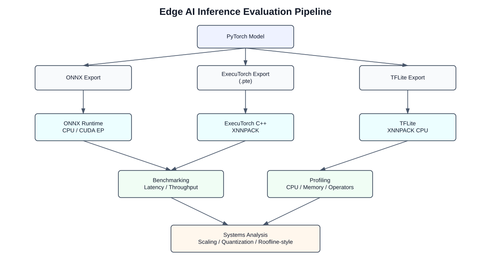
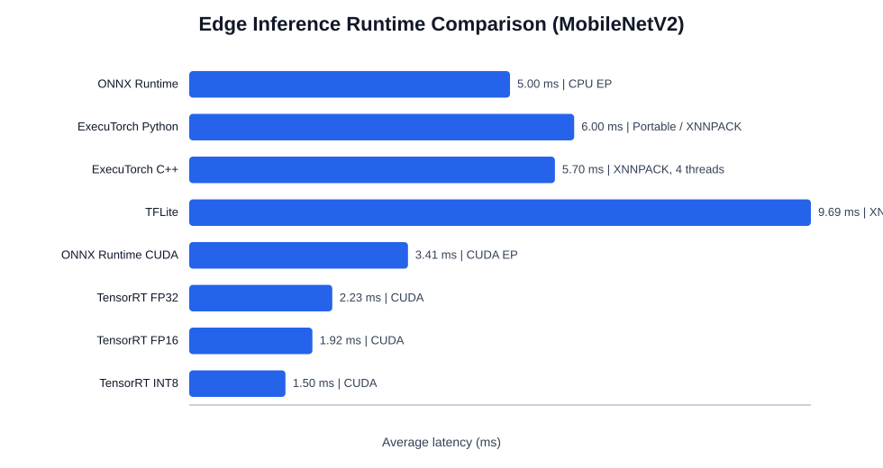
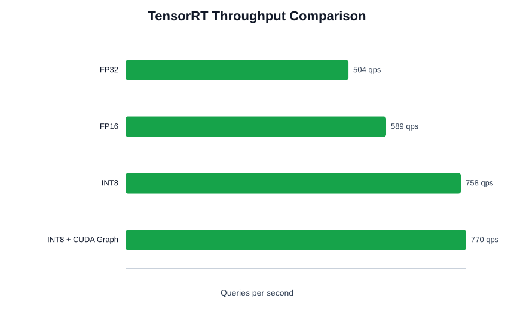
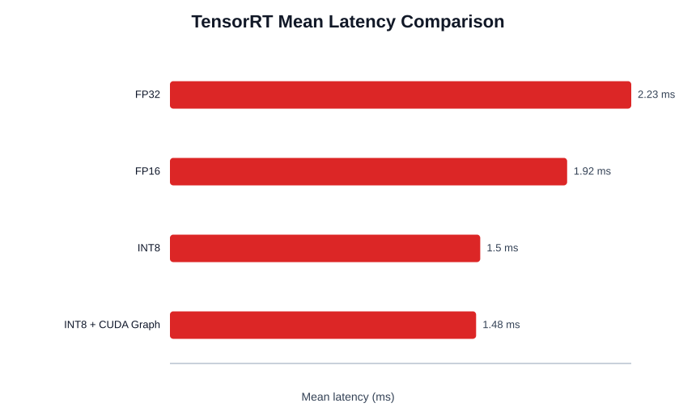
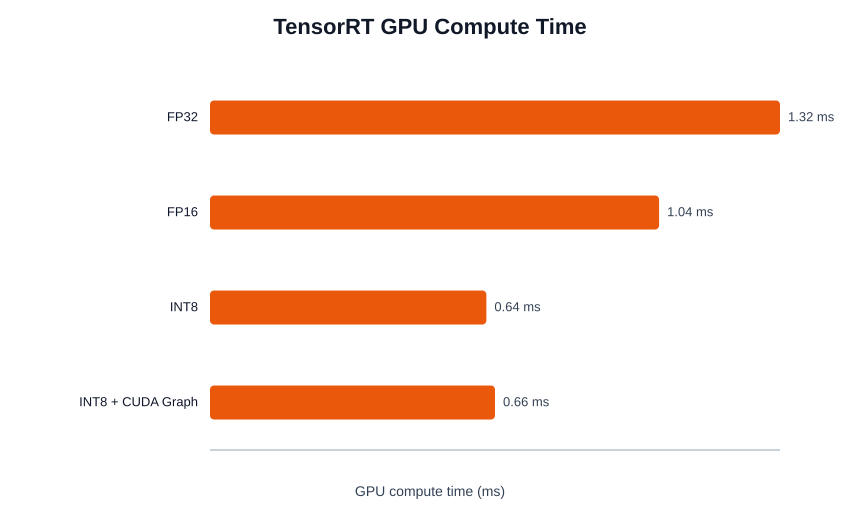
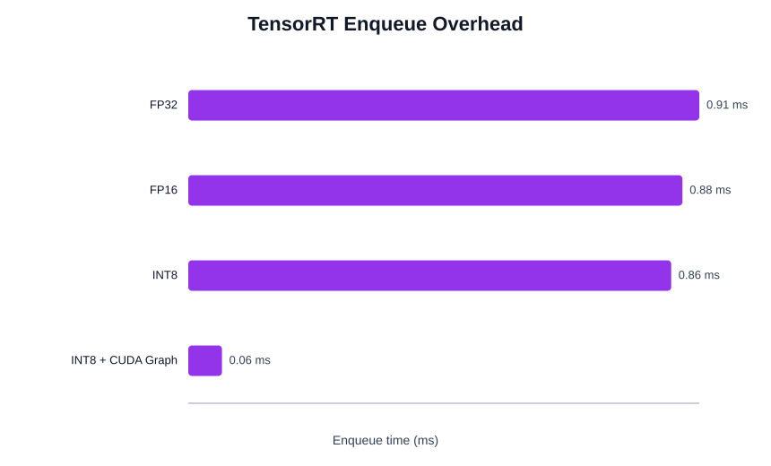
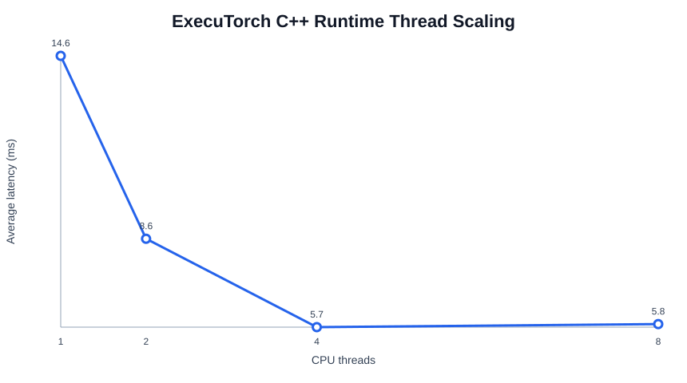
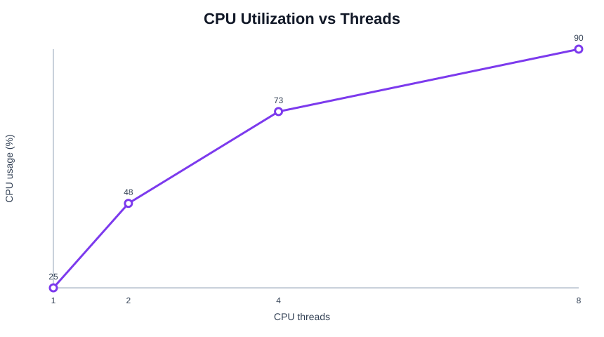
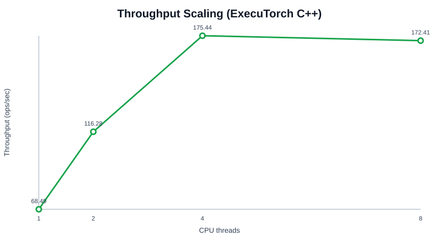
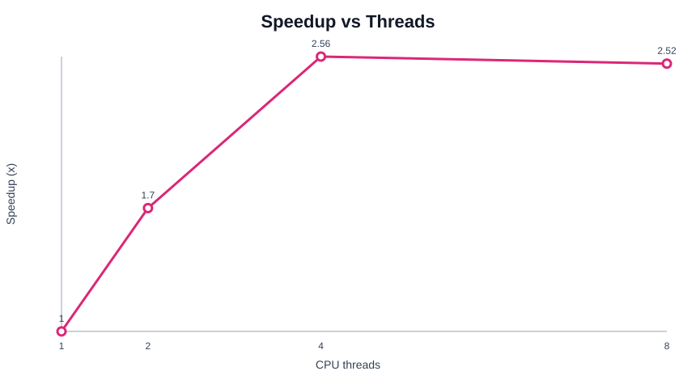

# Edge AI Inference Optimization
## ExecuTorch + ONNX Runtime + TensorRT Runtime Systems Analysis

Production-style edge inference evaluation pipeline for analyzing runtime behavior, deployment trade-offs, multi-thread scaling, quantization impact, CUDA execution behavior, TensorRT optimization, and hardware-aware inference across modern AI runtimes.

The project evaluates:
- ONNX Runtime
- TensorRT
- ExecuTorch Python runtime
- ExecuTorch C++ runtime
- TensorFlow Lite XNNPACK delegate
- Custom CUDA kernels

with a focus on:
- Runtime systems engineering
- GPU inference optimization
- Edge deployment analysis
- CPU/GPU scaling behavior
- Quantization trade-offs
- Runtime bottleneck analysis
- CUDA runtime scheduling
- Roofline-style systems interpretation

---

## System Overview



This project evaluates edge inference across ONNX Runtime, TensorRT, ExecuTorch, and TFLite, then analyzes:
- latency
- throughput
- enqueue overhead
- GPU compute behavior
- CPU utilization
- memory footprint
- quantization behavior
- runtime bottlenecks

under CPU and GPU deployment environments.

---

## Key Capabilities

- Multi-runtime edge inference benchmarking
- ExecuTorch C++ runtime integration
- TensorRT FP32 / FP16 / INT8 benchmarking
- CUDA Graph runtime optimization analysis
- Custom CUDA kernel implementation
- XNNPACK backend execution
- CPU thread-scaling analysis
- Runtime latency / throughput profiling
- Quantization deployment analysis
- Memory footprint evaluation
- Runtime bottleneck analysis
- Roofline-style performance interpretation
- Hardware-aware inference evaluation

---

## Engineering Motivation

Most ML projects stop at:
- model training
- inference APIs
- high-level framework usage

This project focuses on the systems layer of AI deployment:
- runtime execution
- GPU kernel behavior
- hardware-aware inference
- deployment trade-offs
- scaling behavior
- scheduling overhead
- memory bottlenecks
- runtime profiling

The goal is to understand how inference systems behave under realistic deployment constraints.

---

## Runtime Comparison

This project benchmarks MobileNetV2 across ONNX Runtime, TensorRT, ExecuTorch, and TFLite.



| Runtime | Backend | Avg Latency |
|---|---|---:|
| ONNX Runtime | CPU EP | ~5.00 ms |
| ExecuTorch Python | Portable / XNNPACK | ~6.00 ms |
| ExecuTorch C++ | XNNPACK, 4 threads | ~5.70 ms |
| TFLite | XNNPACK CPU delegate | ~9.69 ms |
| ONNX Runtime CUDA | CUDA EP | ~3.41 ms |
| TensorRT FP32 | CUDA | ~2.23 ms |
| TensorRT FP16 | CUDA | ~1.92 ms |
| TensorRT INT8 | CUDA | ~1.50 ms |

Key insight:
TensorRT significantly reduced inference latency relative to CPU runtimes through GPU acceleration and precision-aware execution.

---

## CUDA Kernel Engineering

The project includes custom CUDA kernel implementations for studying:
- GPU execution behavior
- thread hierarchy
- memory hierarchy
- kernel launch overhead
- shared-memory optimization

Implemented kernels:
- CUDA vector addition
- Naive CUDA matrix multiplication
- Shared-memory tiled matrix multiplication

---

## CUDA Vector Add Benchmark

### Block Size Sweep


The experiment evaluates:
- CUDA block size
- grid configuration
- kernel launch efficiency
- runtime scheduling overhead

Observed behavior suggests:
- relatively stable execution across block sizes
- mild degradation at excessively large thread blocks
- launch overhead dominates simple compute kernels

---

## CUDA Matrix Multiplication

### Naive CUDA MatMul

- GPU latency: ~1.75 ms
- CPU baseline: ~586 ms

### Shared-Memory Tiled CUDA MatMul

- GPU latency: ~1.07 ms
- ~1.6× speedup over naive CUDA implementation

Key optimization:

```text
shared-memory tiling
```

This reduces:
- redundant global memory accesses
- memory bandwidth pressure

while improving:
- data reuse
- arithmetic intensity

---

## TensorRT Precision Optimization

The project evaluates TensorRT inference across:
- FP32
- FP16
- INT8

---

## Throughput Comparison



Observed throughput:
- FP32: ~504 qps
- FP16: ~589 qps
- INT8: ~758 qps

INT8 achieved:
- ~50% throughput improvement over FP32

---

## Mean Latency Comparison



Observed latency:
- FP32: ~2.23 ms
- FP16: ~1.92 ms
- INT8: ~1.50 ms

INT8 achieved:
- ~33% latency reduction relative to FP32

---

## GPU Compute Time



Observed behavior:
- reduced GPU compute time with lower precision
- INT8 produced the lowest compute latency

This demonstrates:

```text
precision-aware runtime optimization
```

---

## CUDA Graph Runtime Scheduling Analysis

The project also evaluates:

```text
TensorRT + CUDA Graph execution
```

to study:
- runtime launch overhead
- enqueue scheduling cost
- CPU-side dispatch overhead

---

## Enqueue Overhead



Observed enqueue overhead:
- INT8 baseline: ~0.86 ms
- INT8 + CUDA Graph: ~0.06 ms

CUDA Graph reduced enqueue overhead by:

```text
~93%
```

This demonstrates:
- reduced CPU launch overhead
- graph-captured execution optimization
- lower runtime dispatch overhead

However:
- overall latency improvement was limited
- GPU compute variability and WDDM scheduling jitter remained significant bottlenecks on the laptop GPU environment

---

## Thread Scaling Analysis

### Latency vs Threads


### CPU Utilization vs Threads


### Throughput Scaling


### Speedup Analysis


---

## Key Findings

### 1. Thread Scaling

- Latency improves significantly from 1 → 4 threads
- ~2.5× speedup achieved
- Diminishing returns beyond 4 threads

This suggests:
- effective parallelization initially
- saturation near hardware limits

---

### 2. CPU Utilization

Observed CPU utilization:
- ~25% (1 thread)
- ~90% (8 threads)

This confirms:
- workload is CPU-intensive
- parallel execution is active
- thread scheduling meaningfully affects performance

---

### 3. Throughput Scaling

Throughput scales nearly linearly up to 4 threads before plateauing.

This indicates:
- efficient parallel execution
- emerging memory/system bottlenecks at higher thread counts

---

### 4. Runtime Comparison

ONNX Runtime CUDA and TensorRT significantly outperformed CPU-only runtimes under the current GPU environment.

TensorRT further improved latency through:
- precision lowering
- runtime optimization
- CUDA execution optimization
- graph-level inference acceleration

ExecuTorch C++ reached latency comparable to ONNX Runtime CPU execution using:
- XNNPACK backend
- multi-thread execution
- native C++ runtime integration

---

### 5. Quantization Analysis

INT8 quantization reduced:
- runtime latency
- GPU compute time
- deployment artifact size

However:
- lower precision alone does not eliminate runtime bottlenecks
- enqueue scheduling and GPU execution variability still affect end-to-end latency

This highlights deployment trade-offs between:
- memory efficiency
- runtime scheduling
- compute throughput
- hardware utilization

---

## Systems Engineering Insights

Observed runtime behavior suggests:

- Near-linear scaling from 1 → 4 CPU threads
- Saturation beyond 4 threads
- Increasing CPU utilization with thread count
- TensorRT enqueue overhead becoming significant at low GPU compute latency
- CUDA Graph reducing CPU-side dispatch overhead
- Remaining GPU variability likely caused by:
  - WDDM scheduling
  - dynamic clock scaling
  - synchronization overhead
  - memory bandwidth pressure

These behaviors are consistent with hardware-aware inference systems operating near hardware resource limits.

---

## Roofline-Style Interpretation

The observed scaling behavior is consistent with Roofline-style performance analysis:

- Performance improves with increased parallelism in compute-bound regions
- Scaling efficiency declines as workloads approach hardware limits
- Runtime bottlenecks shift between:
  - compute throughput
  - memory bandwidth
  - synchronization overhead
  - runtime dispatch overhead

CUDA tiled matrix multiplication improved arithmetic intensity through shared-memory reuse, demonstrating the transition from memory-bound toward more compute-efficient execution.

---

## Memory and Deployment Analysis

The project evaluates:
- runtime RSS memory usage
- deployment artifact size
- model loading overhead
- quantized deployment size
- GPU execution overhead

Observed behavior demonstrates:

```text
Artifact size ≠ runtime memory footprint
```

Runtime memory behavior depends on:
- tensor allocation
- runtime buffers
- intermediate activations
- operator workspace requirements
- CUDA runtime buffers
- execution scheduling behavior

not only serialized model size.

---

## Methodology

### Models

- MobileNetV2

### Execution Environments

- CPU-only inference
- CUDA GPU inference
- Windows execution environment
- XNNPACK-enabled runtimes
- TensorRT runtime execution

### Metrics Collected

- Average latency
- Tail latency (p95 / p99)
- Throughput
- CPU utilization
- GPU compute time
- Enqueue overhead
- Speedup scaling
- Runtime memory usage
- Model load latency

### Benchmarking Controls

- Fixed execution counts
- Warmup handling
- Thread-count variation
- Repeated execution runs
- CUDA synchronization
- Precision-controlled inference

---

## Tech Stack

### Languages

- Python
- C++
- CUDA

### Inference Runtimes

- ONNX Runtime
- TensorRT
- ExecuTorch
- TensorFlow Lite

### Backends

- CUDA Execution Provider
- XNNPACK
- TensorRT Runtime
- CPU Execution Provider

### Libraries / Tooling

- PyTorch
- TensorFlow Lite
- CUDA Toolkit
- TensorRT
- Matplotlib
- NumPy

---

## Project Structure

```text
edge-onnx-benchmark/
├── benchmarks/        # benchmarking + plotting scripts
├── cuda_backend/      # custom CUDA kernels and backend dispatch
├── results/           # generated metrics and visualizations
├── executorch_export/
├── models/
├── docs/
└── README.md
```

---

## What This Demonstrates

This project demonstrates ability to:

- Deploy models across multiple inference runtimes
- Work with low-level inference runtimes (C++ / CUDA)
- Implement custom GPU kernels
- Analyze GPU execution behavior
- Evaluate precision-performance trade-offs
- Profile runtime scheduling overhead
- Benchmark TensorRT inference optimization
- Analyze thread-level scaling behavior
- Perform runtime bottleneck analysis
- Evaluate quantization impact
- Interpret hardware-aware inference behavior
- Design reproducible performance engineering workflows

---

## Future Extensions

- CUDA stream overlap analysis
- TensorRT plugin development
- Operator fusion experiments
- Custom execution scheduler
- CUDA Graph pipeline scheduling
- Android / embedded deployment
- Apple Silicon benchmarking
- TFLite GPU / NPU delegate evaluation
- CoreML / MLX integration
- Hardware-counter profiling
- Thermal / power analysis
- Delegate partitioning analysis
- Real roofline modeling
- Memory allocator analysis

---

## References

- ONNX Runtime
- TensorRT
- ExecuTorch
- TensorFlow Lite
- XNNPACK
- CUDA Toolkit
- PyTorch
