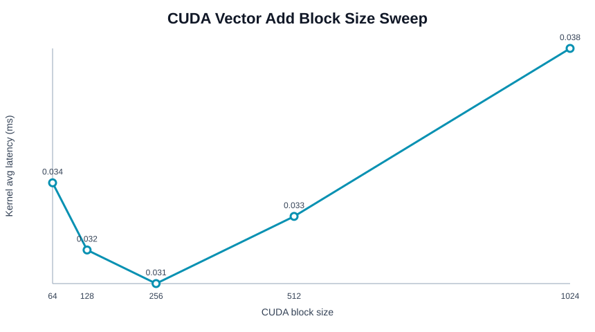

# CUDA Backend Analysis

## Overview

This document analyzes the custom CUDA backend experiments implemented in this project.

The goal is to understand GPU execution fundamentals before integrating higher-level GPU inference runtimes such as TensorRT.

This phase focuses on:

- CUDA kernel launch
- Thread hierarchy
- Block / grid configuration
- Host-device memory transfer
- Synchronization
- Global memory behavior
- Shared memory tiling
- Kernel-level performance analysis

---

## 1. Motivation

High-level inference runtimes such as TensorRT optimize GPU execution through:

- Kernel fusion
- Memory reuse
- Tensor Core dispatch
- Asynchronous execution
- Optimized scheduling

To understand these optimizations, this project first implements custom CUDA kernels from scratch.

---

## 2. CUDA Vector Add

### Kernel

The first CUDA kernel implements:

```cpp
c[i] = a[i] + b[i]
```

Each CUDA thread computes one output element.

### Execution Configuration

```text
N elements: 1,048,576
Block size: 256
Grid size: 4096
```

### Initial Result

| Mode | Latency |
|---|---:|
| CPU vector add | ~3.89 ms |
| CUDA kernel only | ~0.86 ms |
| CUDA end-to-end | ~6.41 ms |

### Key Insight

The CUDA kernel itself was faster than CPU execution, but end-to-end latency was slower due to:

- Host-to-device copy
- Device-to-host copy
- Kernel launch overhead
- Synchronization cost

This demonstrates an important GPU systems principle:

```text
Kernel latency is not equal to deployment latency.
```

---

## 3. Block Size Sweep

The vector add kernel was evaluated across multiple CUDA block sizes.

| Block Size | Grid Size | Kernel Avg Latency |
|---:|---:|---:|
| 64 | 16384 | ~0.1316 ms |
| 128 | 8192 | ~0.1314 ms |
| 256 | 4096 | ~0.1315 ms |
| 512 | 2048 | ~0.1317 ms |
| 1024 | 1024 | ~0.1320 ms |



### Key Insight

Latency remained almost constant across block sizes.

This suggests vector add is memory-bound rather than compute-bound.

Vector add has very low operational intensity:

```text
1 floating-point add per element
2 global memory loads + 1 global memory store
```

Therefore, performance is dominated by memory bandwidth rather than arithmetic throughput.

---

## 4. CUDA Naive Matrix Multiplication

### Kernel

The naive matrix multiplication kernel computes:

```cpp
C[row][col] = sum(A[row][k] * B[k][col])
```

Each thread computes one output element.

### Configuration

```text
Matrix size: 512 x 512
Block size: 16 x 16
Grid size: 32 x 32
```

### Result

| Mode | Latency |
|---|---:|
| CPU naive matmul | ~586.67 ms |
| CUDA naive matmul | ~1.75 ms |

### Key Insight

CUDA execution significantly accelerated naive matrix multiplication compared with a naive CPU baseline.

However, this comparison should be interpreted carefully:

```text
This compares naive CPU code against a custom CUDA kernel, not optimized CPU BLAS.
```

---

## 5. Tiled Shared Memory Matrix Multiplication

### Motivation

The naive CUDA matmul repeatedly reads from global memory.

To improve data reuse, the tiled kernel loads blocks of A and B into shared memory.

Execution pattern:

```text
Global memory
    ↓
Shared memory tile
    ↓
Thread-level reuse
    ↓
Output accumulation
```

### Configuration

```text
Matrix size: 512 x 512
Tile size: 16 x 16
Grid size: 32 x 32
```

### Result

| Kernel | Latency |
|---|---:|
| CUDA naive matmul | ~1.75 ms |
| CUDA tiled shared-memory matmul | ~1.07 ms |

### Speedup

```text
1.75 / 1.07 ≈ 1.64x
```

### Key Insight

Shared memory tiling improved performance by reducing redundant global memory accesses.

This demonstrates the importance of:

- Memory hierarchy
- Data reuse
- Tiling
- Shared memory optimization

---

## 6. GPU Memory Hierarchy Lessons

This phase demonstrates multiple GPU memory principles:

### Global Memory

- Large capacity
- High latency
- Bandwidth-limited
- Used for main tensor storage

### Shared Memory

- Small capacity
- Low latency
- Explicitly managed
- Used for tile reuse

### Registers

- Fastest storage
- Per-thread
- Used for local accumulation

### Host Memory

- CPU-side memory
- Requires explicit transfer to GPU device memory

---

## 7. CUDA Synchronization Lessons

The experiments highlight multiple synchronization points:

- `cudaMemcpy`
- `cudaDeviceSynchronize`
- `cudaEventSynchronize`
- `__syncthreads`

### Key Insight

Synchronization is necessary for correctness, but can introduce overhead.

High-performance GPU inference systems try to reduce synchronization overhead through:

- Kernel fusion
- Stream scheduling
- Asynchronous memory copies
- Persistent device buffers

---

## 8. Relationship to TensorRT

TensorRT performs many optimizations that connect directly to these CUDA experiments:

| CUDA Concept | TensorRT Optimization |
|---|---|
| Kernel launch overhead | Kernel fusion |
| Host-device transfer | Persistent device buffers |
| Global memory traffic | Memory reuse / fusion |
| Shared memory tiling | Optimized GEMM / convolution kernels |
| Synchronization overhead | Stream scheduling |
| Precision control | FP16 / INT8 execution |

This CUDA backend phase provides the foundation for understanding what TensorRT optimizes internally.

---

## 9. Systems Engineering Takeaways

This phase demonstrates:

- CUDA thread hierarchy
- Block/grid configuration
- Memory-bound kernel behavior
- Host-device transfer overhead
- Shared memory tiling
- GPU memory hierarchy
- Kernel-level benchmarking
- GPU execution correctness validation

The work moves beyond using GPU inference libraries and builds intuition for how GPU runtimes execute workloads internally.

---

## 10. Future Work

Potential next steps:

- Add tiled matmul block-size sweep
- Add end-to-end CUDA matmul timing
- Add CUDA streams
- Add pinned memory transfer benchmark
- Add ONNX Runtime CUDA comparison
- Add TensorRT FP32 / FP16 engine benchmarking
- Add TensorRT kernel fusion analysis
- Add GPU roofline-style analysis

---

## Summary

This custom CUDA backend phase establishes the foundation for GPU runtime systems work.

It demonstrates:

- How CUDA kernels are launched
- How memory transfer affects deployment latency
- How block size affects kernel execution
- How shared memory tiling improves data reuse
- Why high-level runtimes such as TensorRT matter

This provides a bridge from CPU edge inference runtime analysis to GPU inference runtime engineering.
